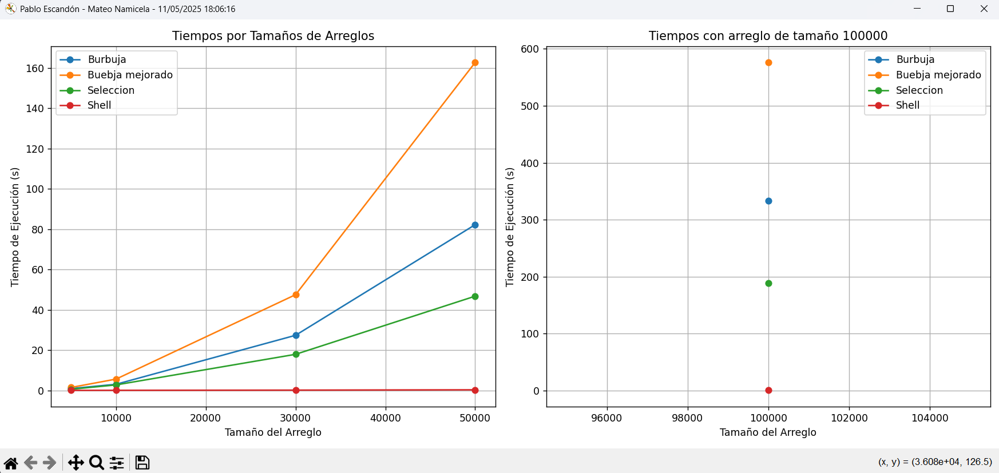

# Práctica de Algoritmos de Ordenamiento

## 📌 Información General

- **Título:** Práctica de Algoritmos de Ordenamiento
- **Asignatura:** Estructura de Datos
- **Carrera:** Computación
- **Estudiantes:** Pablo Escandón, Mateo Namicela  
- **Fecha:** 11/05/25
- **Profesor:** Ing. Pablo Torres

---

## 🛠️ Descripción

Este proyecto implementa y compara diferentes algoritmos de ordenamiento en **Python**, incluyendo:

- Método Burbuja  
- Método Burbuja Mejorado  
- Método Selección  
- Método Shell  

El sistema realiza lo siguiente:
- Evalúa el tiempo de ejecución de cada algoritmo con arreglos de distintos tamaños.
- Presenta gráficos comparativos con `matplotlib` para visualizar el rendimiento.
- Utiliza un conjunto de datos generado aleatoriamente para cada prueba.

---

## 🚀 Ejecución

Para ejecutar el proyecto:

1. Asegurarse de tener Python y las librerías necesarias:
    ```bash
    pip install matplotlib
    ```

2. Ejecuta el script principal:
    ```bash
    python main.py
    ```

---

## 📊 Visualización de Resultados

El programa genera dos gráficos de líneas:

- **Gráfico 1:** Tiempos de ejecución por tamaños crecientes de arreglos.
- **Gráfico 2:** Comparación de tiempos con un arreglo de tamaño fijo (100,000 elementos).

### Ejemplo:



---

## 🧠 Conclusiones

- Los algoritmos de ordenamiento muestran diferencias notables en eficiencia a medida que aumenta el tamaño del arreglo.
- En términos de notación Big-O:
  - **Burbuja y Selección** tienen una complejidad de \( O(n^2) \), lo que los hace ineficientes con entradas grandes.
  - **Shell Sort** mejora considerablemente el rendimiento con una complejidad aproximada de \( O(n \log^2 n) \) en el peor caso, mostrando ser más adecuado para conjuntos grandes.
  - **Burbuja Mejorado** presenta una leve mejora sobre el Burbuja clásico al reducir iteraciones innecesarias.